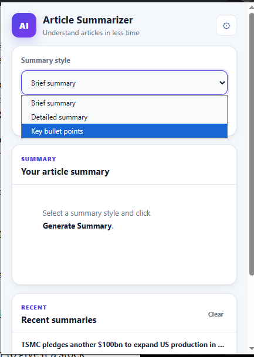
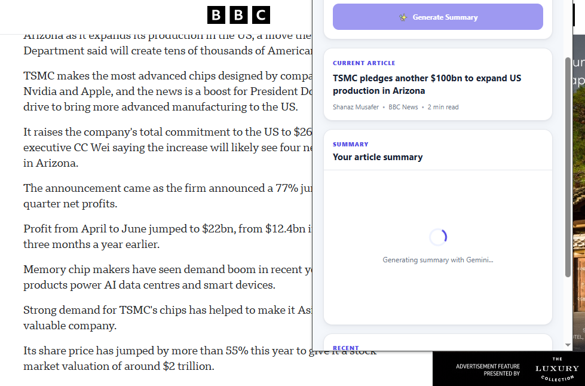
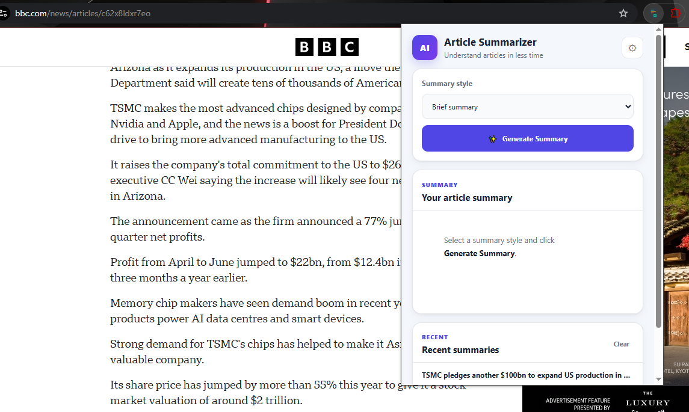
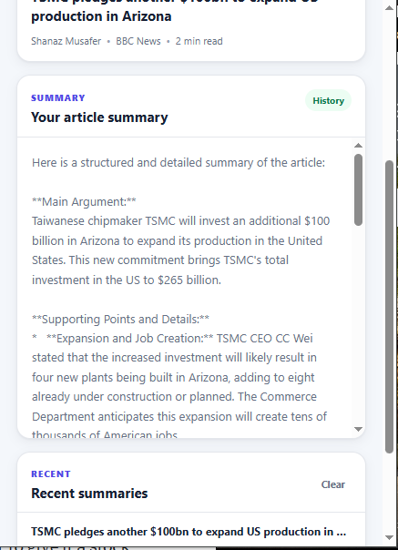
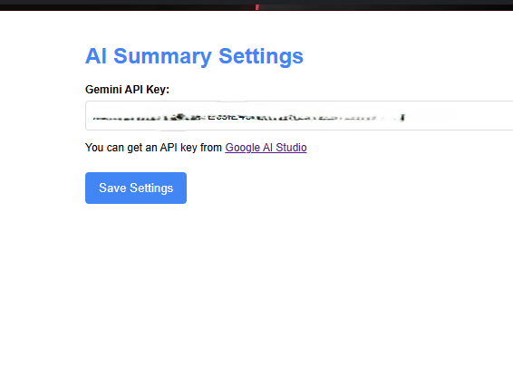

# 🚀 AI Article Summarizer Chrome Extension

> Instantly summarize online articles using **Google Gemini AI** with intelligent article extraction, smart caching, Markdown export, and a modern Chrome Extension experience.

<p align="center">


</p>

---

## ✨ Features

### 🤖 AI Powered Summaries

- Brief Summary
- Detailed Summary
- Bullet Point Summary
- Powered by Google Gemini

### 📄 Smart Article Extraction

Uses **Mozilla Readability** to accurately extract article content from websites like BBC, Medium, Dev.to, Wikipedia and many more.

### ⚡ Intelligent Caching

- Cache based on **Article URL + Summary Type**
- Faster repeated summaries
- Reduced Gemini API calls

### 📚 Summary History

- Stores recent summaries locally
- Restore previous summaries
- Clear history anytime

### 📝 Markdown Export

Export summaries as Markdown files for notes, documentation and knowledge bases.

### 📖 Reading Time

Displays estimated reading time for the original article.

### 🎨 Modern UI

- Responsive popup
- Loading spinner
- Error handling
- Copy to clipboard
- Settings page

---

# 🖼 Screenshots

## 🏠 Main Popup



---

## ⏳ Generating Summary



---

## 🤖 Generated Summary





---

## ⚙️ Settings Page



---

# 🏗️ Project Architecture

```text
popup/
├── popup.html
├── popup.css
├── popup.js
├── article.js
├── gemini.js
├── storage.js
├── history.js
├── markdown.js
└── ui.js
```

---

# 🛠 Tech Stack

- JavaScript (ES6 Modules)
- HTML5
- CSS3
- Chrome Extension Manifest V3
- Google Gemini API
- Mozilla Readability
- Chrome Storage API
- Fetch API
- Clipboard API
- Blob API

---

# 🚀 Installation

```bash
git clone https://github.com/ADITISHARMA-22/AI-Summarizer-chrome-extention.git
```

1. Open `chrome://extensions`
2. Enable **Developer Mode**
3. Click **Load unpacked**
4. Select the project folder
5. Add your Gemini API key from the Settings page

---

# 💡 Why Mozilla Readability?

Instead of relying only on `document.querySelector("article")`, this extension uses Mozilla Readability to intelligently extract the main content while removing ads, navigation, comments and sidebars, resulting in much better summaries.

---

# ⚡ Performance Optimizations

- URL + Summary Type caching
- Cache expiration
- Duplicate request prevention
- Local summary history
- Markdown export
- Modular ES6 architecture

---

# 🔮 Future Improvements

- PDF Export
- Keyboard Shortcuts
- Stream Gemini Responses
- Multi-language Support
- Chat with Article
- Cloud Sync

---

# 📚 What I Learned

- Chrome Extension Development
- Manifest V3
- Content Scripts
- Chrome Storage API
- ES6 Modules
- Google Gemini API
- Mozilla Readability
- Browser Messaging
- Client-side Caching
- Markdown Generation

---

# 👨‍💻 Author

**Aditi Sharma**

Frontend Developer

- GitHub: https://github.com/ADITISHARMA-22
- LinkedIn: https://www.linkedin.com/in/aditiiisharma22/

---

## ⭐ Support

If you like this project, consider giving it a **⭐ Star** on GitHub!
